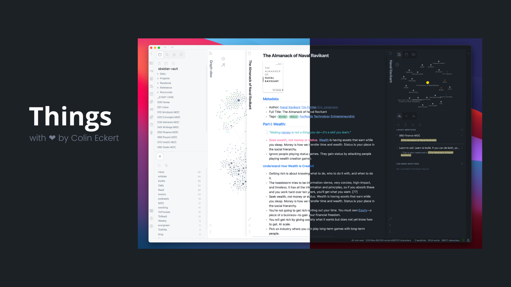
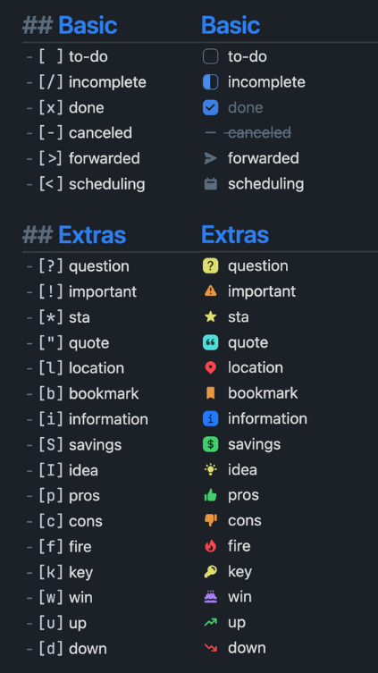

### Notes on V1 of this theme

V1 of this theme was built using code from **@kepano's** great Minimal theme. Please support @kepano's work!

Support **@kepano** on [Twitter](https://www.twitter.com/kepano) or [Buy @kepano a coffee](https://www.buymeacoffee.com/kepano)

<a href="https://www.buymeacoffee.com/kepano"></a>

# Things 2



I love [Things 3](https://culturedcode.com/things/). It's been the task manager I've trusted and used for years, partly because the design makes using the app so enjoyable. I wanted to bring that same joy to Obsidian by creating a Things-inspired design that looked and felt native on MacOS and iOS.

The lastest release of Things leverages much of the newly improved design scheme released in Obsidian 1.0, adding the Things V1 theme's thoughtful color scheme, helpful floating action button, customization options, and unique flair.

## Features

- Things-inspired color palette
- Light and dark theme
- Quick preview/edit floating action button on mobile
- Customizable colors for bold, italic, highlighters, and block-quotes via the [Style Settings](https://github.com/mgmeyers/obsidian-style-settings) community plugin
- Atom code syntax higlighting
- Enhanced code blocks with line numbers
- Tag pills for readability
- Checkbox styling and icons
- Better designed image cards
- [JetBrains Mono](https://www.jetbrains.com/lp/mono/) font and ligatures for code

## Supported Plugins

This theme has support for the following Obsidian community plugins (Things V1):

- [Sliding Panes (Andy's Mode)](https://github.com/deathau/sliding-panes-obsidian)
- [Calendar](https://github.com/liamcain/obsidian-calendar-plugin)
- [Kanban](https://github.com/mgmeyers/obsidian-kanban)
- [Hider](https://github.com/kepano/obsidian-hider)
- [Checklist](https://github.com/delashum/obsidian-checklist-plugin)
- [Todoist](https://github.com/jamiebrynes7/obsidian-todoist-plugin) (ironic, I know)
- [Style Settings](https://github.com/mgmeyers/obsidian-style-settings)
- [Advanced Mobile Toolbar](https://github.com/phibr0/obsidian-advanced-toolbar)

## Checkbox Styling

Things supports a wide number of alternate checkbox types. These allow you to call out tasks that are incomplete, canceled, rescheduled, etc. See below for availale checkbox types.



```
## Basic
- [ ] to-do
- [/] incomplete
- [x] done
- [-] canceled
- [>] forwarded
- [<] scheduling

## Extras
- [?] question
- [!] important
- [*] star
- ["] quote
- [l] location
- [b] bookmark
- [i] information
- [S] savings
- [I] idea
- [p] pros
- [c] cons
- [f] fire
- [k] key
- [w] win
- [u] up
- [d] down
- [D] draft pull request
- [P] open pull request
- [M] merged pull request
```

## Installation

### Obsidian Marketplace (Recommended)

1. Open the **Settings** in Obsidian
1. Navigate to **Appearances** tab under **Options**
1. Under the **Themes** section, click on the `Manage` button across from **Themes**
1. Search for `Things` in the Filter text input
1. Click `Use` and then you're done! 🎉

### Manual

1. Download this repo
1. Copy the `theme.css` file into your vault's `/.obsidian/themes` directory
1. Rename the file to `Things.css` so it will have a unique name in the theme selection dropdown
1. Open the **Settings** in Obsidian
1. Navigate to **Appearances** tab under **Options**
1. Under the **Themes** section, click on the dropdown menu next to **Theme** heading
1. Select `Things` and then you're done! 🎉

## Feedback

If you have any issues and/or suggestions, please submit an issue or raise a PR. I will try my best to answer as quickly as possible!

## Credits

Again, I owe a huge hat tip to **@kepano** and his Minimal Theme, which served as the base for this theme, as well as to **@chetachiezikeuzor** and her Yin and Yang Theme for further inspiration on building an elegant, native-feeling design!

## Support

🎉 You can help me keep improving _things_ like this by supporting development: **@colineckert** on [Twitter](https://www.twitter.com/colineckert) or [Buy me a coffee](https://www.buymeacoffee.com/colineckert).

<a href="https://www.buymeacoffee.com/colineckert"></a>
